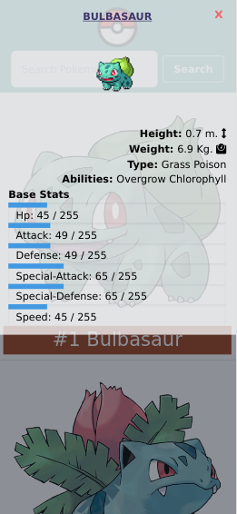

<!-- Badges -->
<p>
  
  <a href="#" target="_blank">
    
  </a>
  <a href="https://twitter.com/redacuve" target="_blank">
    
  </a>
</p>

<!-- Project Header -->
  <p align="center">
    
  <br>
  </p>
  <h1 align="center">Project Poke-Catalogue</h1>
  <p align="center">
  <br>
   <a href="https://github.com/redacuve/poke-catalogue"><strong>Explore the repo »</strong></a>
  <br>
    <a href="https://github.com/redacuve/poke-catalogue/issues">Request Feature</a>
  </p>
  <h2 align="center"><a href="https://poke-catalogue.netlify.app/"><strong>Live Link!</strong></a></h2>

<!-- TABLE OF CONTENTS -->

## Table of Contents

* [About the Project](#about-the-project)

    * [Screenshot](#screnshoots)

    * [Preview](#preview)

* [Built With](#built-with)

* [Getting Started](#getting-started)

* [How it Works](#how-it-works)

* [Contributing](#contributing)

* [License](#license)

* [Contact](#contact)

<!-- ABOUT THE PROJECT -->

## About The Project

This project start with the idea of making an infinite scroll and finished with a full catalogue of pokemon, you can see the first 25 pokemon, if you scroll down, it will fetch another 25 pokemon, if you click on one pokemon you can see a card with the information of that pokemon, also you can search for a specific pokemon. 

This app is fully responsive, made with TailwindCss, and React.

This Catalogue is of Pokemons, It uses the [Poke API](https://pokeapi.co/).

### Screenshots

#### Desktop

  <p align="center">
    <br>
    <br>
    <br>
    <br>
  </p>

#### Mobile

  <p align="center">
    <br>
    <br>
    <br>
    <br>
  </p>

### Preview

<p align="center">
    
</p>

## Built With

* [React](https://reactjs.org/docs/getting-started.html)

* [HTML5](https://developer.mozilla.org/es/docs/HTML/HTML5)

* [CSS](https://developer.mozilla.org/es/docs/Web/CSS)

* [TailwindCss](https://tailwindcss.com/docs/installation)

* Deployed with
    * [netlify](https://docs.netlify.com/)

* npm Packages used:
    * [react](https://www.npmjs.com/package/react)
    * [prop-types](https://www.npmjs.com/package/prop-types)
    * [eslint](https://www.npmjs.com/package/eslint)
    * [stylelint](https://www.npmjs.com/package/stylelint)
    * [postcss-cli](https://www.npmjs.com/package/postcss-cli)

<!-- GETTING STARTED -->
## Getting Started

To get a local copy up and running follow these simple steps.

Clone or fork the <a href="https://github.com/redacuve/poke-catalogue">repo</a> [git@github.com:redacuve/poke-catalogue.git]

*note you need have install npm or yarn
* [npm](https://www.npmjs.com/get-npm)
* [yarn](https://classic.yarnpkg.com/en/docs/install)


<!-- HOW IT WORKS -->
## How it Works

This project was bootstrapped with [Create React App](https://github.com/facebook/create-react-app).

This App uses infinite Scrolling to prevent obtaining 1000+ pokemon at the same time, also it uses functional components and stateful components, also it uses hooks.

This is a SPA, (it uses only the homepage for everything), retrieves the information from the API and set on the internal state of the parent component (PokemonContainer), and if you search a single pokemon that information is saved on the NavbarComponent and it passes to a child component to show the pokemon card.

This application has the source code inside the src folder, the file structure for this project are:
* assets folder: Here are the assets like the logo and the CSS files (not a single line of CSS because everything is atomic CSS thanks to tailwindcss framework).
* components folder: Here are all of the stateless components Like errors, loading, or cards.
* containers folder: Here are all of the components that retrieve data from the API, and had state (stateful component like pokemonContainer or functional component with hooks like navbar).
* index.js file: Here is where is render the application in the div with id = "root".

Also, this project is fully responsive for all types of devices, mobile, tablet, desktop, wide-desktop, it uses tailwindCss for that.

## Running the code

*   Navigate to the root directory of the project

*   Run this command on your terminal to install all of the dependecies:
    ```
    $ npm install
    ```

*   Run this command on your terminal to run the code locally on http://localhost:3000:
    ```
    $ npm start
    ```

*   Also you can build this app for production, react are going to make a build folder with minified files, and filenames with hashes for best performance
    ```
    $ npm build
    ```
*   Run this command to Lint the JS files:
    ```
    $ npx eslint .
    ```
*   Run this command to Lint the CSS/SCSS files:
    ```
    $ npx stylelint "**/*.{css,scss}"
    ```
*   You can learn more in the [Create React App Documentation](https://facebook.github.io/create-react-app/docs/getting-started).

* To learn React, check out the [React Documentation](https://reactjs.org/docs/getting-started.html).

<!-- CONTRIBUTING -->

## Contributing

Contributions are what make the open source community such an amazing place to be learn, inspire, and create. Any contributions you make are **greatly appreciated**.

1. Fork the Project

2. Create your Feature Branch (`git checkout -b feature/AmazingFeature`)

3. Commit your Changes (`git commit -m 'Add some AmazingFeature'`)

4. Push to the Branch (`git push origin feature/AmazingFeature`)

5. Open a Pull Request

<!-- LICENSE -->

## License

This project is under the <a href="https://www.gnu.org/licenses/gpl-3.0.html">GNU Public License V3</a>. For more information see <a href="https://github.com/redacuve/poke-catalogue/blob/master/LICENSE">here</a>

<!-- CONTACT -->

## Contact

Rey David Cuevas Vela - [@redacuve](https://twitter.com/redacuve) - redacuve@gmail.com -[linkedin.com/in/redacuve/](https://www.linkedin.com/in/redacuve/)

Project Link: [github.com/redacuve/good-meals-catalog](https://github.com/redacuve/poke-catalogue) - Poke-Catalogue.